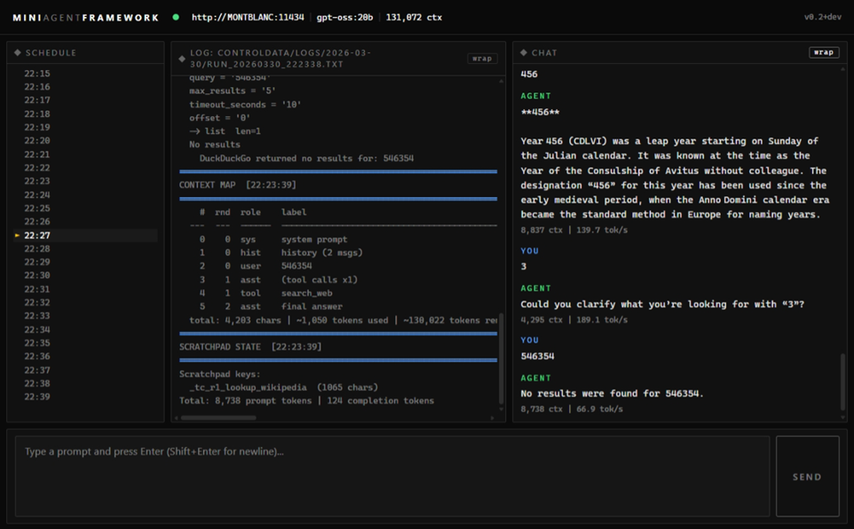

# MiniAgentFramework

> Calling an LLM from Python is easy - this project researches calling Python *from* an LLM prompt.

MiniAgentFramework is an orchestration experiment that blends LLM reasoning with Python tool execution. A local LLM decides which Python skills to call, executes them safely in ordered steps, and incorporates the results into its final response.

The project uses a local [Ollama](https://ollama.com) runtime and focuses on transparent, logged orchestration with tools for testing and measuring agent behaviour. From the orchestration foundation it builds simple, robust skills with performance measurement and self-improvement research on top.



## Documentation

| Document | Contents |
|---|---|
| **This file** | Modes, commands, task management, usage reference |
| [README_GETTING_STARTED.md](README_GETTING_STARTED.md) | First-time setup: Python, Ollama, venv, first run |
| [README_DEVS.md](README_DEVS.md) | Module architecture, design notes, internal flow |
| [ChangeLog.md](ChangeLog.md) | Report of main changes per version |
---

## Quick Start

For a full first-time walkthrough (Python install, Ollama, venv, first run) see [README_GETTING_STARTED.md](README_GETTING_STARTED.md).

### Regenerate the skills catalog
Run this whenever a `skill.md` file is added or changed:
```powershell
python .\code\skills_catalog_builder.py
```

---

## Running: Web UI / API Mode

Running `main.py` with no special mode flags starts the FastAPI server and browser UI.

```powershell
python .\code\main.py
python .\code\main.py --ollama-host MONTBLANC
python .\code\main.py --api-port 8010 --model 20b --num-ctx 65536
```

What this mode provides:
- Browser UI with schedule timeline, queue preview, live logs, and chat panel.
- Background scheduler for tasks under `controldata/schedules/`.
- Prompt queue with a separate total queued prompt count and a preview of the next prompts to be serviced.
- REST API endpoints used by the UI for queue, timeline, logs, history, and prompt submission.

| Option | Default | Description |
|---|---|---|
| `--model ALIAS` | `"20b"` | Ollama model alias or tag. Short aliases like `20b` resolve to the first installed model whose tag contains that string. |
| `--num-ctx N` | `131072` | Context window size used for LLM calls. |
| `--api-port PORT` | `8000` | Port for the web UI/API server. |
| `--api-host HOST` | `0.0.0.0` | Bind host for the web UI/API server. |
| `--ollama-host URL` | `http://localhost:11434` | Ollama host to use. Accepts a LAN address such as `http://MONTBLANC:11434` or `https://api.ollama.com`. Falls back to `OLLAMA_HOST`. |

Open the browser UI at `http://localhost:8000/` unless you changed `--api-port`.

---

## Scheduled Tasks

Scheduled prompt tasks run inside Web UI / API mode. Each `*.json` file in `controldata/schedules/` can define one or more tasks with either a daily time (`HH:MM`) or a repeating interval (minutes). Tasks fire unattended and are serialised through the shared task queue.

Schedule files live in `controldata/schedules/`. Each file must contain a top-level `"tasks"` list:

```json
{
  "tasks": [
    {
      "name": "SystemHealth",
      "enabled": true,
      "schedule": { "type": "interval", "minutes": 60 },
      "prompts": ["Summarise current system health: CPU, RAM, and disk."]
    },
    {
      "name": "MorningWebScan",
      "enabled": true,
      "schedule": { "type": "daily", "time": "05:00" },
      "prompts": ["Summarise today's tech news headlines."]
    }
  ]
}
```

Each task file is typically named `task_<name>.json`. Tasks can be created, queried, and managed at runtime - see [Task Management](#task-management) below.

---

## Slash Commands

Slash commands are available in the **Web UI** chat input and inside **scheduled task prompt lists**. They bypass the orchestration pipeline and take effect immediately.

Type `/help` at any prompt to see the full list. Current commands:

| Command | Description |
|---|---|
| `/help` | List all available slash commands |
| `/models` | List installed Ollama models; the active model is marked with `►` |
| `/model <name>` | Switch the active model for all subsequent runs (e.g. `/model 8b`). Accepts the same short aliases as `--model`. Clears conversation history. |
| `/host <target>` | Switch the active Ollama host without restarting. Clears conversation history. See [Host targeting](#host-targeting) below. |
| `/ctx` | Show the context map for the last run - index, round, label, char count, and compaction state - plus the current window size. |
| `/ctx size` | Show the current context window size only. |
| `/ctx size <n>` | Set the context window size for all subsequent runs (e.g. `/ctx size 32768`). Accepts integers with optional commas or underscores. |
| `/ctx item <n>` | Print the raw message content for context-map entry N. Useful for inspecting what was sent to the model in a specific round. |
| `/ctx compact <n>` | Compact context-map entry N in place - replaces the message content with a one-line summary and saves the original to the scratchpad. Prints the before/after table. |
| `/timeout <seconds>` | Set the LLM generation timeout (e.g. `/timeout 1800` for heavy analysis tasks). |
| `/stopmodel [name]` | Unload a running model from VRAM. Defaults to the active model if no name given. |
| `/clearmemory` | Delete the memory store file (`memory_store.json`), starting the next session with a blank memory. |
| `/newchat` | Clear conversation history and session context, starting a fresh chat without restarting. |
| `/reskill` | Rebuild the skills catalog from `skill.md` files (fast local path) and hot-reload into the current session. The catalog is also rebuilt automatically at startup whenever any `skill.md` is newer than `skills_summary.md`. |
| `/sandbox <on\|off>` | Toggle the Python sandbox for `CodeExecute` skill. `on` (default) enforces the built-in allow-list; `off` removes restrictions (use with care). |
| `/deletelogs <days>` | Delete log date-folders under `controldata/logs/` older than N days. Each folder is named `YYYY-MM-DD` and contains all runs from that day. Useful as a scheduled task prompt (e.g. `/deletelogs 10`). |
| `/test <prompts-file>` | Run the test wrapper against a prompts file from `controldata/test_prompts/` and stream results live. The current host and model are forwarded automatically. Omit the argument to list available files. The argument is matched as a case-insensitive substring, so `/test web` matches `test_web_skill_prompts.json`. |
| `/test all` | Run every `*.json` file in `controldata/test_prompts/` in sequence, streaming results live. All results are written to a single combined CSV file (`test_results_<timestamp>_all.csv`) with a banner printed between each suite. Prints a final summary with host, model, elapsed time, and cumulative pass/fail count. |
| `/recall` | Show a summary of all skill outputs stored in the current session context (URLs fetched, files written, search results, etc.). |
| `/tasks` | List all scheduled tasks with their status (on/off), schedule, and prompt preview. |
| `/task enable <name>` | Enable a task by name. The API scheduler picks up the change on its next reload cycle. |
| `/task disable <name>` | Disable a task without deleting it. |
| `/task add <name> <schedule> <prompt>` | Create a new task. `schedule` is either a number of minutes (e.g. `60`) or a daily wall-clock time (e.g. `08:30`). |
| `/task delete <name>` | Permanently delete a task and remove its JSON file if it becomes empty. |
| `/task run <name>` | Execute a task immediately, outside its normal schedule. Runs the same pipeline as the scheduler - useful for testing a task definition or triggering a one-off run. |
| `/version` | Show framework version, active model, and context size. |

### Host targeting

`/host` accepts several forms, all equivalent in meaning:

| Input | Resolves to |
|---|---|
| `/host local` | `http://localhost:11434` |
| `/host MONTBLANC` | `http://MONTBLANC:11434` |
| `/host 192.168.1.169` | `http://192.168.1.169:11434` |
| `/host http://192.168.1.169:11434` | `http://192.168.1.169:11434` (unchanged) |
| `/host https://api.ollama.com` | `https://api.ollama.com` (unchanged) |

Any bare hostname or IP address (no `://`) is automatically wrapped as `http://<name>:11434` - the standard Ollama default port. Full URLs are passed through unchanged, so custom ports and HTTPS cloud endpoints work too.

Connectivity to the host is **not** checked at switch time. The connection is verified lazily on the first LLM call made after the switch. This means `/host` always succeeds immediately, and any connectivity problem is reported precisely when an LLM call is attempted - not before. Slash commands continue to work regardless of whether the active host is reachable.

New slash commands can be added in [code/slash_commands.py](code/slash_commands.py) by adding a handler function and registering it in `_REGISTRY` and `_DESCRIPTIONS`.

---

## Task Management

Scheduled tasks can be managed in three complementary ways, depending on the context:

### 1. Slash commands (operator, in-session)

The `/tasks` and `/task` commands manipulate `controldata/schedules/*.json` files directly from the Web UI chat input. Zero LLM involvement - changes are instant and deterministic.

```
/tasks                                          # list all tasks
/task add HourlyMemCheck 60 Check free RAM and log to data/memlog.csv
/task add DailyWeather 08:00 Get today's weather forecast for London
/task enable DailyWeather
/task disable HourlyMemCheck
/task delete OldTask
```

The API scheduler hot-reloads schedule files each poll cycle, so enable/disable/add/delete take effect within seconds without a restart.

### 2. TaskManagement skill (agent, via natural language)

The `TaskManagement` skill exposes the same operations as proper skill functions, so the model can call them in response to natural-language chat prompts:

| Chat prompt | Skill call |
|---|---|
| `"list my scheduled tasks"` | `list_tasks()` |
| `"show me the PerformanceHeadroom task"` | `get_task("PerformanceHeadroom")` |
| `"create a task called DailyWeather running at 8am to check the forecast"` | `create_task("DailyWeather", "08:00", "...")` |
| `"change PerformanceHeadroom to run every 30 minutes"` | `set_task_schedule("PerformanceHeadroom", "30")` |
| `"disable the PerformanceHeadroom task"` | `set_task_enabled("PerformanceHeadroom", False)` |
| `"update the DailyWeather prompt to ask about London"` | `set_task_prompt("DailyWeather", "...")` |
| `"delete the OldTask task"` | `delete_task("OldTask")` |

The skills catalog (`code/skills/skills_summary.md`) is rebuilt automatically at startup whenever any `skill.md` is newer than the summary - so newly added skills are always available to the model without any manual step. Use `/reskill` to force a rebuild during an active session.

### 3. Direct JSON editing

Each task lives in its own `controldata/schedules/task_<name>.json` file and can be edited in any text editor. The scheduler hot-reloads all `*.json` files in the schedules directory each cycle.

```json
{
  "tasks": [
    {
      "name": "PerformanceHeadroom",
      "enabled": true,
      "schedule": { "type": "interval", "minutes": 60 },
      "prompts": [
        "Use SystemInfo to get free RAM and disk, then append a CSV row to data/performanceheadroom.csv."
      ]
    }
  ]
}
```

### Schedule types

| Type | JSON | Meaning |
|---|---|---|
| Interval | `{ "type": "interval", "minutes": 60 }` | Fires every N minutes after the previous run |
| Daily | `{ "type": "daily", "time": "08:30" }` | Fires once per calendar day at the given wall-clock time |

---

## Other Utilities

### Inspect tool definitions
Useful for debugging which tools are visible to the model and verifying that skill signatures are parsed correctly:
```powershell
python .\code\preprocess_prompt.py
python .\code\preprocess_prompt.py --output tool_definitions.json
```

| Option | Default | Description |
|---|---|---|
| `--skills-summary PATH` | `code/skills/skills_summary.md` | Path to the skills catalog file. |
| `--output PATH` | *(stdout)* | Optional path to write the JSON Schema tool definitions. Omit to print to stdout. |

### Monitor Ollama memory usage
Samples Ollama process RSS before and during model inference to characterise memory requirements:
```powershell
python .\code\system_check.py
python .\code\system_check.py --num-ctx 4096
```

| Option | Default | Description |
|---|---|---|
| `--num-ctx N` | none | Optional context window size to request during the test inference call. |

---

## Logs and Output

| Path | Contents |
|---|---|
| `controldata/logs/YYYY-MM-DD/` | Runtime evidence logs (`run_YYYYMMDD_HHMMSS.txt`) - one file per run, grouped into dated subfolders. |
| `controldata/schedules/` | Schedule definition files (`*.json`) consumed by the Web UI / API scheduler. |
| `controldata/test_prompts/` | Prompt suite JSON files used by the `/test` slash command. |
| `controldata/test_results/` | Timestamped CSV results and analysis files produced by `/test`. |

Each log file contains full evidence for its run: resolved model, memory recall, tool rounds, tool call outputs, final LLM response, and per-call token throughput.
