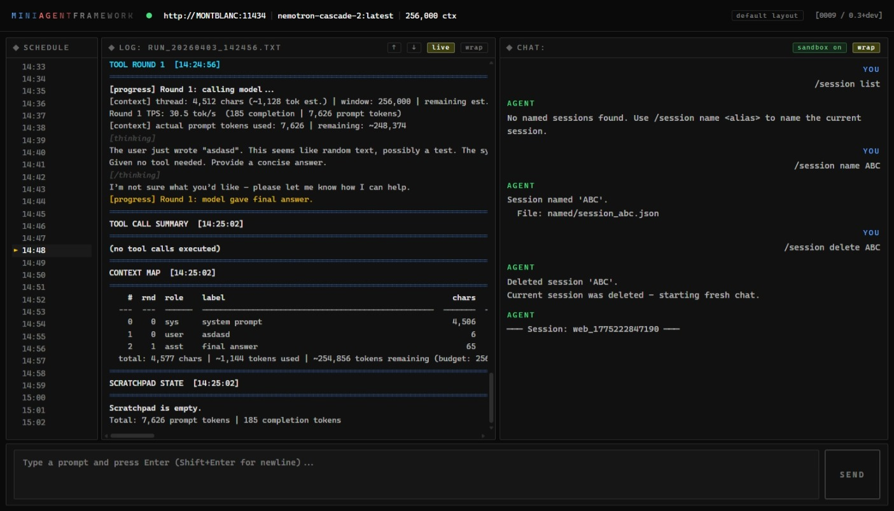

# MiniAgentFramework

Local-first agent framework for local LLMs.

MiniAgentFramework runs locally, uses local tools, and shows you what it is doing as it goes. You send a prompt; the LLM chooses Python skills, executes them in ordered steps, and returns the result while the orchestration log streams live in the UI.

If you want local agents without cloud dependencies, hidden orchestration, or framework sprawl, this is the project.



## Why this exists

- Local-first: built around local model servers ([Ollama](https://ollama.com), [LM Studio](https://lmstudio.ai)), local Python tools, and local files.
- Transparent: tool calls, intermediate steps, and orchestration logs are visible instead of hidden.
- Practical: scheduled runs, persistent chat sessions backed by KoreConversation, live logs, and file-writing workflows are built in.
- Lightweight: aimed at real agent workflows without requiring a large abstraction stack.

## Get Running Fast

From a fresh clone:

```powershell
git clone https://github.com/DaveSteadman/MiniAgentFramework.git
cd MiniAgentFramework
python -m venv .venv
.\.venv\Scripts\Activate.ps1
pip install -r requirements.txt
python .\main.py
```

Then open:

```text
http://localhost:8000/
```

If you want the full standing-start walkthrough, including Ollama install and first model pull, use [README_GETTING_STARTED.md](README_GETTING_STARTED.md).

## First 10 Minutes

Once the UI is open, try one prompt that shows the full loop:

```text
Summarise todays developments in AI hardware in 5 bullet points.
```

What you should see:

- the live log stream showing tool choices and execution steps
- the final answer in the chat panel
- a dated log file written under `datacontrol/logs/`

This is the core experience of the framework: local LLM, local tools, visible reasoning pipeline.

## What You Can Do

- Run background web research or system-monitoring tasks on a schedule, entirely unattended.
- Keep named chat sessions that survive restarts - park a session mid-conversation and resume it later.
- Automate data collection and write results to structured CSV or text files using natural-language prompts.
- Build and regression-test agent behaviours with the built-in test runner and pass-rate trend reporting.

## Why Use This Instead of a Bigger Framework?

- You want local execution and no API-key dependency.
- You want to see exactly which tools were called and what happened at each step.
- You want something you can inspect, edit, and extend without learning a large orchestration platform first.

## Documentation

| Document | Contents |
|---|---|
| **This file** | Positioning, quick start, main usage reference |
| [README_GETTING_STARTED.md](README_GETTING_STARTED.md) | First-time setup from a blank machine: Python, Ollama, venv, first run |
| [README_DEVS.md](README_DEVS.md) | Module architecture mapped to code folders |
| [DESIGN.md](DESIGN.md) | Design claims, SSE event contract, component responsibilities |
| [ChangeLog.md](ChangeLog.md) | Report of main changes per version |

---

## Running the Framework

Running `main.py` from the repository root starts the local API server and Web UI. It loads defaults, connects to the configured model server, and exposes the REST/SSE endpoints used by the browser UI.

```powershell
python .\main.py
python .\main.py --llmhost MONTBLANC
python .\main.py --llmhost lmstudio
python .\main.py --agentport 8010 --model 20b --ctx 65536
```

## Running the WebUI

On startup, the framwork provides a URL to open in a browser:

```
===================================================================================
SYSTEM STATUS  [14:21:09]
===================================================================================

Ollama host:     http://MONTBLANC:11434
Requested model: nemotron-cascade-2:latest
Resolved model:  nemotron-cascade-2:latest
Mode:            api
ctx:             256000
LLM timeout:     600s
Max iterations:  25
Model runtime status: nemotron-cascade-2:latest not currently loaded (ollama ps).
Log file:        C:/Util/MAF/datacontrol/logs/2026-04-03/run_20260403_142109.txt

API mode - http://0.0.0.0:8000  (Ctrl+C to stop)
Web UI:   http://localhost:8000/    <-- open this in your browser
```

The web UI provides:
- Schedule timeline showing upcoming and recent task runs.
- Live log panel with full orchestration evidence for every run.
- Chat panel with streamed responses and session switching.
- Prompt queue with count and next-prompt preview.

---

## Command-Line Options

All options are optional. Unrecognised options are rejected at startup with a usage message.

| Option | Default | Description |
|---|---|---|
| `--model ALIAS` | `"20b"` | Model alias or tag. Short aliases like `20b` resolve to the first available model whose tag contains that string. |
| `--ctx N` | `131072` | Context window size used for LLM calls. |
| `--agentport PORT` | `8000` | Port for the web UI/API server. Always binds to 0.0.0.0. |
| `--llmhost URL` | `http://localhost:11434` | Inference server URL or alias. `lmstudio` resolves to `http://localhost:1234`; `local` resolves to `http://localhost:11434`. Bare hostnames are wrapped as `http://<name>:11434`. Also read from `LLMHOST` env var. |

### Default overrides file

`default.json` (repo root) lets you persist your preferred settings without touching the command line. Values are applied after the factory defaults but before any explicit CLI argument, so a CLI flag always wins.

```json
{
  "model":       "20b",
  "ctx":         131072,
  "agentport":   8000,
  "llmhost":  "http://localhost:11434"
}
```

To target LM Studio instead of Ollama, set `"llmhost": "lmstudio"`. The `lmstudio` alias resolves to `http://localhost:1234` and routes all model listing and chat calls to LM Studio's OpenAI-compatible API.

Only the recognised keys are accepted. Unknown keys print a warning at startup and are ignored. The file is optional - if absent, factory defaults apply as usual.

---

## Slash Commands

Slash commands are available in the **Web UI** chat input and inside **scheduled task prompt lists**. They bypass the orchestration pipeline and take effect immediately.

Type `/help` at any prompt to see the full list. Tab completion is available in the Web UI: pressing Tab after a `/` character opens a dropdown of matching commands and sub-commands.

| Command | Description |
|---|---|
| `/help` | List all available slash commands |
| `/llmserver <backend> <host>` | Switch the active model server. `backend` is `ollama` or `lmstudio`; `host` is the URL or bare `hostname:port`. With no arguments, shows the current server. Examples: `/llmserver ollama MONTBLANC:11434`, `/llmserver lmstudio 192.168.1.1:1234`. Clears conversation history. See [Model server targeting](#model-server-targeting) below. |
| `/llmserverconfig` | Show the current model, context window, and backend. |
| `/llmserverconfig model list` | List models available on the active server (all installed models for both Ollama and LM Studio). |
| `/llmserverconfig model <name>` | Switch the active model. Accepts short aliases (e.g. `8b`) for Ollama; use the exact model ID for LM Studio (e.g. `openai/gpt-oss-20b`). LM Studio can host multiple models simultaneously - this selects which one the next chat targets. Clears conversation history. |
| `/llmserverconfig ctx <n>` | Set the context window size for all subsequent runs (e.g. `/llmserverconfig ctx 32768`). |
| `/ctx` | Show the context map for the last run - index, round, label, char count, and compaction state - plus the current window size. |
| `/ctx size` | Show the current context window size only. |
| `/ctx size <n>` | Set the context window size for all subsequent runs (e.g. `/ctx size 32768`). Accepts integers with optional commas or underscores. |
| `/ctx item <n>` | Print the raw message content for context-map entry N. Useful for inspecting what was sent to the model in a specific round. |
| `/ctx compact <n>` | Compact context-map entry N in place - replaces the message content with a one-line summary and saves the original to the scratchpad. Prints the before/after table. |
| `/rounds <n>` | Set the max tool-call rounds per prompt (e.g. `/rounds 6`). |
| `/timeout <seconds>` | Set the LLM generation timeout (e.g. `/timeout 1800` for heavy analysis tasks). |
| `/stoprun` | Cancel the active LLM run (after its current round finishes) and clear all pending queued prompts. Executes immediately - does not wait in the queue. Pending prompts receive a `Cancelled by /stoprun.` response. |
| `/stopmodel [name]` | **Ollama only.** Unload a running model from VRAM. Defaults to the active model if no name given. Not supported in LM Studio mode - use the LM Studio UI instead. |
| `/clearmemory` | Delete the memory store file (`memory_store.json`), starting the next session with a blank memory. |
| `/newchat` | Clear conversation history and session context, starting a fresh chat without restarting. |
| `/reskill [min\|max]` | Rebuild the skills catalog and set system prompt guidance mode. Defaults to `min` if omitted. |
| `/sandbox <on\|off>` | Toggle the Python sandbox for `CodeExecute` skill. `on` (default) enforces the built-in allow-list; `off` removes restrictions (use with care). |
| `/deletelogs <days>` | Delete date-folders older than N days under `datacontrol/logs/` and `datacontrol/test_results/`. Useful as a scheduled task prompt (e.g. `/deletelogs 10`). |
| `/defaults` | Show the active `default.json` settings and file path. `/defaults set` overwrites the file with the current model, ctx, and host values. |
| `/session name <alias>` | Rename the current webchat conversation in KoreConversation. The session ID stays the same; only the conversation subject changes. |
| `/session list` | List resumable webchat conversations from KoreConversation. |
| `/session resume <name>` | Switch to a webchat conversation in KoreConversation and replay its chat history into the UI. |
| `/session resumecopy <source> <new>` | Clone an existing webchat conversation, including message history and metadata, into a new KoreConversation and switch into it. |
| `/session park` | Leave the current conversation in place and open a fresh webchat session ID. A new KoreConversation is created lazily on the first message. |
| `/session delete <name\|all>` | Delete one or all webchat conversations from KoreConversation. If the active session is deleted, a fresh unnamed chat is opened automatically. |
| `/session info` | Show the current session ID plus the linked KoreConversation ID, status, turn count, and token estimate. |
| `/test <prompts-file>` | Run the test wrapper against a prompts file from `datacontrol/test_prompts/` and stream results live. The current host and model are forwarded automatically. Omit the argument to list available files. The argument is matched as a case-insensitive substring, so `/test web` matches `test_web_skill_prompts.json`. |
| `/test all` | Run every `*.json` file in `datacontrol/test_prompts/` in sequence, streaming results live. All results are written to a single combined CSV file (`test_results_<timestamp>_all.csv`) with a banner printed between each suite. Prints a final summary with host, model, elapsed time, and cumulative pass/fail count. |
| `/testtrend [prompts-file]` | Show pass-rate trend across all historical test runs, optionally filtered by prompts file. |
| `/tasks` | List all scheduled tasks with their status (on/off), schedule, and prompt preview. |
| `/task enable <name>` | Enable a task by name. The API scheduler picks up the change on its next reload cycle. |
| `/task disable <name>` | Disable a task without deleting it. |
| `/task add <name> <schedule> <prompt>` | Create a new task. `schedule` is either a number of minutes (e.g. `60`) or a daily wall-clock time (e.g. `08:30`). |
| `/task delete <name>` | Permanently delete a task and remove its JSON file if it becomes empty. |
| `/task run <name>` | Execute a task immediately, outside its normal schedule. Runs the same pipeline as the scheduler - useful for testing a task definition or triggering a one-off run. |
| `/version` | Show the framework version. |

### Model server targeting

`/llmserver` switches the active model server and backend at runtime. Both arguments are required:

| Input | Resolves to | Backend |
|---|---|---|
| `/llmserver ollama localhost:11434` | `http://localhost:11434` | Ollama (local) |
| `/llmserver ollama MONTBLANC:11434` | `http://MONTBLANC:11434` | Ollama (remote) |
| `/llmserver ollama http://192.168.1.169:11434` | `http://192.168.1.169:11434` (unchanged) | Ollama (remote) |
| `/llmserver ollama https://api.ollama.com` | `https://api.ollama.com` (unchanged) | Ollama Cloud |
| `/llmserver lmstudio localhost:1234` | `http://localhost:1234` | LM Studio (local) |
| `/llmserver lmstudio MONTBLANC:1234` | `http://MONTBLANC:1234` | LM Studio (remote) |
| `/llmserver lmstudio http://192.168.1.1:1234` | `http://192.168.1.1:1234` (unchanged) | LM Studio (remote) |

Bare `hostname:port` values (no `://`) are expanded to `http://hostname:port`. Full URLs are passed through unchanged.

`/llmserver` with no arguments shows the current host and backend without making any changes.

Connectivity to the host is checked at switch time. If the target cannot be reached, the host change is rejected and the previous host remains active.

#### Ollama vs LM Studio - what's different

The LLM call itself (`/v1/chat/completions` with tool definitions) is identical for both servers. The difference is in model management:

| Feature | Ollama | LM Studio |
|---|---|---|
| Model listing | All installed models | All installed models (via `/v1/models`) |
| Model switching | `/llmserverconfig model <name>` unloads the previous model and loads the new one | `/llmserverconfig model <name>` selects which loaded model the next chat targets; does not unload others |
| Context window | `ctx` config passed to model; `/llmserverconfig ctx <n>` to change | `ctx` config is ignored - LM Studio uses the context length set when the model was loaded in the UI |
| Session startup | Alias (e.g. `20b`) resolved against installed list | Automatically adopts whatever LM Studio is serving |
| Model unloading | `/stopmodel` flushes VRAM | Not supported via API |
| Server auto-start | Local Ollama started automatically if needed | Must be started manually |

When using LM Studio (`/llmserver lmstudio <host>`), `/llmserverconfig model <name>` sets which model the next chat targets. LM Studio can hold multiple models in memory simultaneously - this command does not unload any of them; it only controls which model ID is sent in the chat payload.

New slash commands can be added in [code/input_layer/slash_commands.py](code/input_layer/slash_commands.py) by adding a handler function and registering it in `_REGISTRY` and `_DESCRIPTIONS`.

---

## Scheduled Tasks

Each `*.json` file in `datacontrol/schedules/` defines one or more tasks with either a daily time (`HH:MM`) or a repeating interval (minutes). Tasks fire unattended and are serialised through the shared task queue. Each file must contain a top-level `"tasks"` list:

```json
{
  "tasks": [
    {
      "name": "SystemHealth",
      "enabled": true,
      "schedule": { "type": "interval", "minutes": 60 },
      "prompts": ["Summarise current system health: CPU, RAM, and disk."]
    },
    {
      "name": "MorningWebScan",
      "enabled": true,
      "schedule": { "type": "daily", "time": "05:00" },
      "prompts": ["Summarise today's tech news headlines."]
    }
  ]
}
```

| Type | JSON | Meaning |
|---|---|---|
| Interval | `{ "type": "interval", "minutes": 60 }` | Fires every N minutes after the previous run |
| Daily | `{ "type": "daily", "time": "08:30" }` | Fires once per calendar day at the given wall-clock time |

Tasks can be created, queried, and managed at runtime - see [Task Management](#task-management) below.


---

## Task Management

Scheduled tasks can be managed in three complementary ways, depending on the context:

### 1. Slash commands (operator, in-session)

The `/tasks` and `/task` commands manipulate `datacontrol/schedules/*.json` files directly from the Web UI chat input. Zero LLM involvement - changes are instant and deterministic.

```
/tasks                                          # list all tasks
/task add HourlyMemCheck 60 Check free RAM and log to data/memlog.csv
/task add DailyWeather 08:00 Get today's weather forecast for London
/task enable DailyWeather
/task disable HourlyMemCheck
/task delete OldTask
```

The API scheduler hot-reloads schedule files each poll cycle, so enable/disable/add/delete take effect within seconds without a restart.

### 2. TaskManagement skill (agent, via natural language)

The `TaskManagement` skill exposes the same operations as proper skill functions, so the model can call them in response to natural-language chat prompts:

| Chat prompt | Skill call |
|---|---|
| `"list my scheduled tasks"` | `task_list()` |
| `"show me the PerformanceHeadroom task"` | `task_get("PerformanceHeadroom")` |
| `"create a task called DailyWeather running at 8am to check the forecast"` | `task_create("DailyWeather", "08:00", "...")` |
| `"change PerformanceHeadroom to run every 30 minutes"` | `task_set_schedule("PerformanceHeadroom", "30")` |
| `"disable the PerformanceHeadroom task"` | `task_set_enabled("PerformanceHeadroom", False)` |
| `"update the DailyWeather prompt to ask about London"` | `task_set_prompt("DailyWeather", "...")` |
| `"delete the OldTask task"` | `task_delete("OldTask")` |

The skills catalog (`code/KoreAgent/skills/skills_summary.md`) is rebuilt automatically at startup whenever any `skill.md` is newer than the summary - so newly added skills are always available to the model without any manual step. Use `/reskill` to force a rebuild during an active session.

### 3. Direct JSON editing

Each task lives in its own `datacontrol/schedules/task_<name>.json` file and can be edited in any text editor. The scheduler hot-reloads all `*.json` files in the schedules directory each cycle.

```json
{
  "tasks": [
    {
      "name": "PerformanceHeadroom",
      "enabled": true,
      "schedule": { "type": "interval", "minutes": 60 },
      "prompts": [
        "Use SystemInfo to get free RAM and disk, then append a CSV row to data/performanceheadroom.csv."
      ]
    }
  ]
}
```

---

## Other Utilities

### Inspect tool definitions
Useful for debugging which tools are visible to the model and verifying that skill signatures are parsed correctly:
```powershell
python .\code\KoreAgent\inspect_tools.py
python .\code\KoreAgent\inspect_tools.py --output tool_definitions.json
```

| Option | Default | Description |
|---|---|---|
| `--skills-summary PATH` | `code/KoreAgent/skills/skills_summary.md` | Path to the skills catalog file. |
| `--output PATH` | *(stdout)* | Optional path to write the JSON Schema tool definitions. Omit to print to stdout. |

### MCP connections

External MCP tool providers are configured in `default.json` under `mcp_connections`. MiniAgentFramework calls each server's `list_tools()` endpoint at startup and exposes the returned tool names unchanged. Use server-owned prefixes such as `koredata_` and `koredocs_`; `expected_prefix` is a validation guard, not a renaming rule. Use `allowed_tools` or `blocked_tools` when a connection should expose only part of its server-side toolset.

```json
{
  "mcp_connections": [
    {
      "name": "KoreData",
      "url": "http://localhost:8800/mcp",
      "enabled": true,
      "purpose": "reference search and retrieval",
      "expected_prefix": "koredata_"
    },
    {
      "name": "KoreDocs",
      "url": "http://127.0.0.1:5500/mcp/sse",
      "enabled": true,
      "purpose": "document navigation, structured editing, and KoreFile authoring",
      "transport": "sse",
      "expected_prefix": "koredocs_"
    }
  ]
}
```

For KoreDocs, prefer the canonical prefixed surface such as `koredocs_get_folder_structure`, `koredocs_create_folder`, `koredocs_get_file`, `koredocs_get_koredoc_outline`, `koredocs_read_koredoc_section`, `koredocs_replace_koredoc_section`, `koredocs_describe_sheet`, `koredocs_find_sheet_rows`, `koredocs_get_named_value`, and the other `koredocs_*sheet*` semantic sheet tools. MiniAgentFramework should expose the prefixed names only.

Use `/mcp status` to see configured connections and `/mcp reconnect` to re-enumerate tools after starting or changing an MCP server.

### Monitor model server memory usage
Samples process RSS before and during model inference to characterise memory requirements. Currently supports Ollama only:
```powershell
python .\code\utils\system_check.py
python .\code\utils\system_check.py --ctx 4096
```

| Option | Default | Description |
|---|---|---|
| `--ctx N` | none | Optional context window size to request during the test inference call. |

---

## Logs and Output

| Path | Contents |
|---|---|
| `datacontrol/logs/YYYY-MM-DD/` | Runtime evidence logs (`run_YYYYMMDD_HHMMSS.txt`) - one file per run, grouped into dated subfolders. |
| `datacontrol/schedules/` | Schedule definition files (`*.json`) consumed by the Web UI / API scheduler. |
| `datacontrol/test_prompts/` | Prompt suite JSON files used by the `/test` slash command. |
| `datacontrol/test_results/` | Timestamped CSV results and analysis files produced by `/test`. |

Each log file contains full evidence for its run: resolved model, memory recall, tool rounds, tool call outputs, final LLM response, and per-call token throughput.
