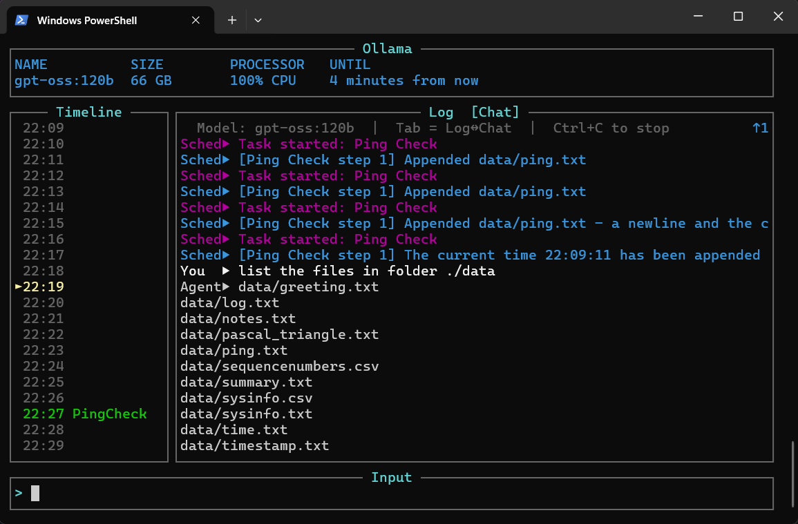

# MiniAgentFramework


> Calling an LLM from Python is easy - this project researches calling Python *from* an LLM prompt.

MiniAgentFramework is an orchestration experiment that blends LLM reasoning with Python tool execution. A local LLM decides which Python skills to call, executes them safely in ordered steps, and incorporates the results into its final response.

The project uses a local [Ollama](https://ollama.com) runtime and focuses on transparent, logged orchestration with tools for testing and measuring agent behaviour. From the orchestration foundation it builds simple, robust skills with performance measurement and self-improvement research on top.

## Documentation

| Document | Contents |
|---|---|
| **This file** | Modes, commands, task management, usage reference |
| [README_GETTING_STARTED.md](README_GETTING_STARTED.md) | First-time setup: Python, Ollama, venv, first run |
| [README_DEVS.md](README_DEVS.md) | Module architecture, design notes, internal flow |
| [ChangeLog.md](ChangeLog.md) | Report of main changes per version |
---

## Modes of Operation

| Mode | Purpose | Typical command |
|---|---|---|
| [**Single-Shot Mode**](#running-single-shot-mode) | Run one prompt through the full pipeline and exit | `python .\code\main.py --user-prompt "what time is it"` |
| [**Chat**](#running-chat-mode) | Interactive multi-turn REPL | `python .\code\main.py --chat` |
| [**Scheduler**](#running-scheduler-mode) | Run scheduled prompt tasks from `controldata/schedules/` unattended | `python .\code\main.py --scheduler` |
| [**Scheduled Item**](#running-schedule-item-mode) | Run one named scheduled task immediately (debugging aid) | `python .\code\main.py --scheduled-item <name>` |
| [**Dashboard**](#running-dashboard-mode) | Full terminal UI: schedule timeline, live log tail, and chat combined | `python .\code\main.py --dashboard` |
| [**Test Wrapper**](#running-test-wrapper) | Run a prompt suite as subprocesses and capture results to a CSV | `python .\testcode\test_wrapper.py` |
| [**Test Analyzer**](#running-test-analyzer) | Classify outcomes and produce diagnostics from a test results CSV | `python .\code\main.py --analysetest <csv>` |
| [**Chat Sequence**](#running-chat-sequence-mode) | Run a pre-defined sequence of prompts sharing a single conversation history | `python .\code\main.py --chat-sequence-file <file.json>` |

---

## Quick Start

For a full first-time walkthrough (Python install, Ollama, venv, first run) see [README_GETTING_STARTED.md](README_GETTING_STARTED.md).

### Regenerate the skills catalog
Run this whenever a `skill.md` file is added or changed:
```powershell
python .\code\skills_catalog_builder.py
```

---

## Running: Single-Shot Mode

Runs one prompt through the full pipeline and exits.

```powershell
python .\code\main.py --user-prompt "what version of ollama is in use"
```

| Option | Default | Description |
|---|---|---|
| `--user-prompt TEXT` | `"output the time"` | The prompt to run. |
| `--model ALIAS` | `"20b"` | Ollama model alias or tag. Short aliases like `20b` are resolved to the first installed model whose tag contains that string. |
| `--num-ctx N` | `131072` | Context window size (tokens) passed to Ollama for all LLM calls. |
| `--ollama-host URL` | `http://localhost:11434` | Ollama host to use. Accepts a LAN address (e.g. `http://MONTBLANC:11434`) or `https://api.ollama.com`. Falls back to `OLLAMA_HOST` env var. Connectivity is checked lazily on the first LLM call, so slash commands work even when the host is unreachable. |

**Example - specify model and context window:**
```powershell
python .\code\main.py --user-prompt "summarize system health" --model "20b" --num-ctx 16384
python .\code\main.py --user-prompt "write the system information to a data/systemstats.csv spreadsheet" --model "gpt-oss:120b" --num-ctx 32768
python .\code\main.py --user-prompt "write a spreadsheet of numbers to data/sequencenumbers.csv where the first column is the index, then an incrementing prime number, then an incrementing fibonacci number" --model "gpt-oss:120b" --num-ctx 32768
```

---

## Running: Chat Mode

Starts an interactive multi-turn REPL. Type `exit` or `quit` to end the session.

```powershell
python .\code\main.py --chat
```

Each turn runs the full orchestration pipeline. The console shows one compact status line per turn:

```
[Turn 1 | 1,204 / 131,072 ctx tokens (0.9%) | 42.3 tok/s | gemma3:20b]
```

Verbose orchestration detail (tool rounds, tool outputs, and final synthesis) is written to the log file only, keeping the console readable.

Conversation history is passed as context for each subsequent turn, capped at the last 10 turns to prevent context overflow.

In console chat mode the prompt supports persistent keyboard history (up/down arrows) backed by `controldata/chathistory.json`, shared across all sessions.

Slash commands (see [Slash Commands](#slash-commands) below) are available at the prompt to change model or context size without restarting.

| Option | Default | Description |
|---|---|---|
| `--chat` | off | Activates chat mode. |
| `--model ALIAS` | `"20b"` | Same alias resolution as single-shot mode. |
| `--num-ctx N` | `131072` | Context window for every turn in the session. |

**Example - chat with a smaller context window:**
```powershell
python .\code\main.py --chat --model "20b" --num-ctx 16384
```

---

## Running: Chat Sequence Mode

Runs a pre-defined sequence of prompts through a shared conversation history - each prompt sees all prior turns in the sequence. Used by the test wrapper to execute multi-turn test scenarios where later steps depend on earlier results.

The sequence file is a JSON array of prompt strings:

```json
["What is the current date?", "Write that date to data/date.txt", "Confirm the file was created."]
```

```powershell
python .\code\main.py --chat-sequence-file controldata/test_prompts/my_sequence.json
```

Output lines are tagged so the test wrapper can parse per-turn results:

```
[TURN 1] User: <prompt>
[TURN 1] Agent: <response>
[TURN 1] tokens=<n> tps=<f>
```

| Option | Default | Description |
|---|---|---|
| `--chat-sequence-file PATH` | *(required)* | JSON file containing an array of prompt strings. |
| `--model ALIAS` | `"20b"` | Ollama model alias or tag. |
| `--num-ctx N` | `131072` | Context window size in tokens. |

---

## Running: Schedule Item Mode

Runs a single named task from the schedule files immediately, bypassing its normal schedule. Useful for debugging a task definition without waiting for its configured time or interval. The `enabled` flag is ignored so disabled tasks can be exercised too.

```powershell
python .\code\main.py --scheduled-item <name>
```

Loads all `*.json` files under `controldata/schedules/`, finds the first task whose `name` matches the supplied value, and runs its full prompt sequence in order.

| Option | Default | Description |
|---|---|---|
| `--scheduled-item NAME` | *(required)* | Name of the task to run. |
| `--model ALIAS` | `"20b"` | Ollama model alias or tag. |
| `--num-ctx N` | `131072` | Context window size. |

**Example:**
```powershell
python .\code\main.py --scheduled-item SystemHealth
python .\code\main.py --scheduled-item morning_web_scan --model "8b"
```

---

## Running: Scheduler Mode

Runs scheduled prompt tasks from `controldata/schedules/` as a background loop. Each `*.json` file in that directory can define one or more tasks with either a daily time (`HH:MM`) or a repeating interval (minutes). Tasks fire unattended and are serialised through the same LLM lock used by all other modes.

```powershell
python .\code\main.py --scheduler
```

Press **Ctrl+C** for a clean shutdown - in-flight LLM calls are allowed to complete before exit.

Schedule files live in `controldata/schedules/`. Each file must contain a top-level `"tasks"` list:

```json
{
  "tasks": [
    {
      "name": "SystemHealth",
      "enabled": true,
      "schedule": { "type": "interval", "minutes": 60 },
      "prompts": ["Summarise current system health: CPU, RAM, and disk."]
    },
    {
      "name": "MorningWebScan",
      "enabled": true,
      "schedule": { "type": "daily", "time": "05:00" },
      "prompts": ["Summarise today's tech news headlines."]
    }
  ]
}
```

Each task file is named `task_<name>.json`. Tasks can be created, queried, and managed at runtime - see [Task Management](#task-management) below.

| Option | Default | Description |
|---|---|---|
| `--model ALIAS` | `"20b"` | Ollama model used for all scheduled task calls. |
| `--num-ctx N` | `131072` | Context window for scheduled task calls. |

---

## Running: Dashboard Mode

Combines the schedule timeline, live log tail, and chat interface in a single terminal UI. Three panels are always visible: the Ollama status bar at the top, a scrolling schedule timeline on the left, and a tabbed main area (Log / Chat) on the right.

```powershell
python .\code\main.py --dashboard
```



| Key | Action |
|---|---|
| **Tab** | Switch between Log and Chat tabs |
| **Enter** | Submit chat prompt (Chat tab) |
| **↑ / ↓ / PgUp / PgDn** | Scroll the active panel |
| **Ctrl+C** | Clean shutdown |

Slash commands (see [Slash Commands](#slash-commands) below) are available in the Chat input bar to change model or context size at runtime.

| Option | Default | Description |
|---|---|---|
| `--model ALIAS` | `"20b"` | Model used for chat prompts in the dashboard. |
| `--num-ctx N` | `131072` | Context window for dashboard chat calls. |


---

## Slash Commands

Slash commands are available in **Chat mode** (console), the **Dashboard** chat input bar, and inside **scheduled task prompt lists**. They bypass the orchestration pipeline and take effect immediately.

Type `/help` at any prompt to see the full list. Current commands:

| Command | Description |
|---|---|
| `/help` | List all available slash commands |
| `/exit` | Exit dashboard mode |
| `/models` | List installed Ollama models; the active model is marked with `►` |
| `/model <name>` | Switch the active model for all subsequent runs (e.g. `/model 8b`). Accepts the same short aliases as `--model`. Clears conversation history. |
| `/host <target>` | Switch the active Ollama host without restarting. Clears conversation history. See [Host targeting](#host-targeting) below. |
| `/ctx` | Show the context map for the last run - index, round, label, char count, and compaction state - plus the current window size. |
| `/ctx size` | Show the current context window size only. |
| `/ctx size <n>` | Set the context window size for all subsequent runs (e.g. `/ctx size 32768`). Accepts integers with optional commas or underscores. |
| `/ctx item <n>` | Print the raw message content for context-map entry N. Useful for inspecting what was sent to the model in a specific round. |
| `/ctx compact <n>` | Compact context-map entry N in place - replaces the message content with a one-line summary and saves the original to the scratchpad. Prints the before/after table. |
| `/timeout <seconds>` | Set the LLM generation timeout (e.g. `/timeout 1800` for heavy analysis tasks). |
| `/stopmodel [name]` | Unload a running model from VRAM. Defaults to the active model if no name given. |
| `/clearmemory` | Delete the memory store file (`memory_store.json`), starting the next session with a blank memory. |
| `/newchat` | Clear conversation history and session context, starting a fresh chat without restarting. |
| `/reskill` | Rebuild the skills catalog from `skill.md` files using the LLM and hot-reload into the current session. The catalog is also rebuilt automatically (fast local path) at startup whenever any `skill.md` is newer than `skills_summary.md`. |
| `/sandbox <on\|off>` | Toggle the Python sandbox for `CodeExecute` skill. `on` (default) enforces the built-in allow-list; `off` removes restrictions (use with care). |
| `/deletelogs <days>` | Delete log date-folders under `controldata/logs/` older than N days. Each folder is named `YYYY-MM-DD` and contains all runs from that day. Useful as a scheduled task prompt (e.g. `/deletelogs 10`). |
| `/test <prompts-file>` | Run the test wrapper against a prompts file from `controldata/test_prompts/` and stream results live. The current host and model are forwarded automatically. Omit the argument to list available files. The argument is matched as a case-insensitive substring, so `/test web` matches `test_web_skill_prompts.json`. |
| `/test all` | Run every `*.json` file in `controldata/test_prompts/` in sequence, streaming results live. Prints a progress line after each file completes, then a final summary with host, model, elapsed time, and cumulative pass/fail count. |
| `/recall` | Show a summary of all skill outputs stored in the current session context (URLs fetched, files written, search results, etc.). |
| `/tasks` | List all scheduled tasks with their status (on/off), schedule, and prompt preview. |
| `/task enable <name>` | Enable a task by name. The dashboard scheduler picks up the change on its next reload cycle. |
| `/task disable <name>` | Disable a task without deleting it. |
| `/task add <name> <schedule> <prompt>` | Create a new task. `schedule` is either a number of minutes (e.g. `60`) or a daily wall-clock time (e.g. `08:30`). |
| `/task delete <name>` | Permanently delete a task and remove its JSON file if it becomes empty. |
| `/task run <name>` | Execute a task immediately, outside its normal schedule. Runs the same pipeline as the scheduler - useful for testing a task definition or triggering a one-off run. |

### Host targeting

`/host` accepts several forms, all equivalent in meaning:

| Input | Resolves to |
|---|---|
| `/host local` | `http://localhost:11434` |
| `/host MONTBLANC` | `http://MONTBLANC:11434` |
| `/host 192.168.1.169` | `http://192.168.1.169:11434` |
| `/host http://192.168.1.169:11434` | `http://192.168.1.169:11434` (unchanged) |
| `/host https://api.ollama.com` | `https://api.ollama.com` (unchanged) |

Any bare hostname or IP address (no `://`) is automatically wrapped as `http://<name>:11434` - the standard Ollama default port. Full URLs are passed through unchanged, so custom ports and HTTPS cloud endpoints work too.

Connectivity to the host is **not** checked at switch time. The connection is verified lazily on the first LLM call made after the switch. This means `/host` always succeeds immediately, and any connectivity problem is reported precisely when an LLM call is attempted - not before. Slash commands continue to work regardless of whether the active host is reachable.

New slash commands can be added in [code/slash_commands.py](code/slash_commands.py) by adding a handler function and registering it in `_REGISTRY` and `_DESCRIPTIONS`.

---

## Task Management

Scheduled tasks can be managed in three complementary ways, depending on the context:

### 1. Slash commands (operator, in-session)

The `/tasks` and `/task` commands manipulate `controldata/schedules/*.json` files directly from the chat input bar or console prompt. Zero LLM involvement - changes are instant and deterministic.

```
/tasks                                          # list all tasks
/task add HourlyMemCheck 60 Check free RAM and log to data/memlog.csv
/task add DailyWeather 08:00 Get today's weather forecast for London
/task enable DailyWeather
/task disable HourlyMemCheck
/task delete OldTask
```

The dashboard hot-reloads schedule files each poll cycle, so enable/disable/add/delete take effect within seconds without a restart.

### 2. TaskManagement skill (agent, via natural language)

The `TaskManagement` skill exposes the same operations as proper skill functions, so the model can call them in response to natural-language chat prompts:

| Chat prompt | Skill call |
|---|---|
| `"list my scheduled tasks"` | `list_tasks()` |
| `"show me the PerformanceHeadroom task"` | `get_task("PerformanceHeadroom")` |
| `"create a task called DailyWeather running at 8am to check the forecast"` | `create_task("DailyWeather", "08:00", "...")` |
| `"change PerformanceHeadroom to run every 30 minutes"` | `set_task_schedule("PerformanceHeadroom", "30")` |
| `"disable the PerformanceHeadroom task"` | `set_task_enabled("PerformanceHeadroom", False)` |
| `"update the DailyWeather prompt to ask about London"` | `set_task_prompt("DailyWeather", "...")` |
| `"delete the OldTask task"` | `delete_task("OldTask")` |

The skills catalog (`code/skills/skills_summary.md`) is rebuilt automatically at startup whenever any `skill.md` is newer than the summary - so newly added skills are always available to the model without any manual step. Use `/reskill` to force an LLM-quality rebuild (better descriptions) during an active session.

### 3. Direct JSON editing

Each task lives in its own `controldata/schedules/task_<name>.json` file and can be edited in any text editor. The scheduler hot-reloads all `*.json` files in the schedules directory each cycle.

```json
{
  "tasks": [
    {
      "name": "PerformanceHeadroom",
      "enabled": true,
      "schedule": { "type": "interval", "minutes": 60 },
      "prompts": [
        "Use SystemInfo to get free RAM and disk, then append a CSV row to data/performanceheadroom.csv."
      ]
    }
  ]
}
```

### Schedule types

| Type | JSON | Meaning |
|---|---|---|
| Interval | `{ "type": "interval", "minutes": 60 }` | Fires every N minutes after the previous run |
| Daily | `{ "type": "daily", "time": "08:30" }` | Fires once per calendar day at the given wall-clock time |

---

## Running: Test Wrapper

Runs a suite of prompts through `code/main.py` as a subprocess and records results to a timestamped CSV.

```powershell
python .\testcode\test_wrapper.py
```

| Option | Default | Description |
|---|---|---|
| `--prompts TEXT [TEXT ...]` | - | One or more prompt strings (overrides `--prompts-file`). |
| `--prompts-file PATH` | `controldata/test_prompts/default_prompts.json` | JSON file containing an array of prompt strings. |
| `--output-dir PATH` | `controldata/test_results/` | Directory where the CSV results file is written. |
| `--model ALIAS` | `"20b"` | Ollama model alias passed to each `main.py` subprocess invocation. |
| `--ollama-host URL` | *(local)* | Ollama host for all subprocess invocations (e.g. `http://MONTBLANC:11434`). Connectivity is checked lazily, so prompts that are pure slash commands never require Ollama to be reachable. |

Each row in the CSV captures: `timestamp`, `prompt`, `final_output`, `duration_seconds`, `exit_code`, `log_file`, `stderr`.

**Example - run a named prompts file:**
```powershell
python .\testcode\test_wrapper.py --prompts-file controldata/test_prompts/test_web_skill_prompts.json
```

**Example - run a custom set of prompts inline:**
```powershell
python .\testcode\test_wrapper.py --prompts "output the time" "what is today's date" "how much RAM is available"
```

---

## Running: Test Analyzer

Analyzes a test results CSV without touching Ollama - reads each row's log file and classifies outcomes.

```powershell
python .\code\main.py --analysetest controldata\test_results\test_results_<timestamp>.csv
```

Or run the analyzer directly:
```powershell
python .\testcode\test_analyzer.py controldata\test_results\test_results_<timestamp>.csv
```

Produces two files alongside the source CSV:

| File | Contents |
|---|---|
| `<name>_analysis.csv` | Per-prompt row with: outcome, failure reason, tools called, tool-calling mode, round count, validation result. |
| `<name>_gaps.txt` | Summary report: pass rate, tool-calling mode breakdown, tool round histogram, skill usage frequency, failing prompts, capability gap signals. |

Outcome labels:

| Label | Meaning |
|---|---|
| `PASS` | Exit 0, non-empty output, no failure signals detected. |
| `FAIL` | Non-zero exit code, empty output, or validation failure in log. |
| `TIMEOUT` | Subprocess exceeded the 300 s timeout (exit code 124). |
| `GAP` | Output contained a capability gap admission (e.g. "I cannot access the internet"). |

---

## Other Utilities

### Inspect tool definitions
Useful for debugging which tools are visible to the model and verifying that skill signatures are parsed correctly:
```powershell
python .\code\preprocess_prompt.py
python .\code\preprocess_prompt.py --output tool_definitions.json
```

| Option | Default | Description |
|---|---|---|
| `--skills-summary PATH` | `code/skills/skills_summary.md` | Path to the skills catalog file. |
| `--output PATH` | *(stdout)* | Optional path to write the JSON Schema tool definitions. Omit to print to stdout. |

### Monitor Ollama memory usage
Samples Ollama process RSS before and during model inference to characterise memory requirements:
```powershell
python .\code\system_check.py
python .\code\system_check.py --num-ctx 4096
```

| Option | Default | Description |
|---|---|---|
| `--num-ctx N` | none | Optional context window size to request during the test inference call. |

---

## Logs and Output

| Path | Contents |
|---|---|
| `controldata/logs/YYYY-MM-DD/` | Runtime evidence logs (`run_YYYYMMDD_HHMMSS.txt`) - one file per run, grouped into dated subfolders. |
| `controldata/schedules/` | Schedule definition files (`*.json`) consumed by Scheduler and Dashboard modes. |
| `controldata/test_prompts/` | Prompt suite JSON files used by the Test Wrapper. |
| `controldata/test_results/` | Timestamped CSV results and analysis files produced by the Test Wrapper and Analyzer. |

Each log file contains full evidence for its run: resolved model, memory recall, tool rounds, tool call outputs, final LLM response, and per-call token throughput.
