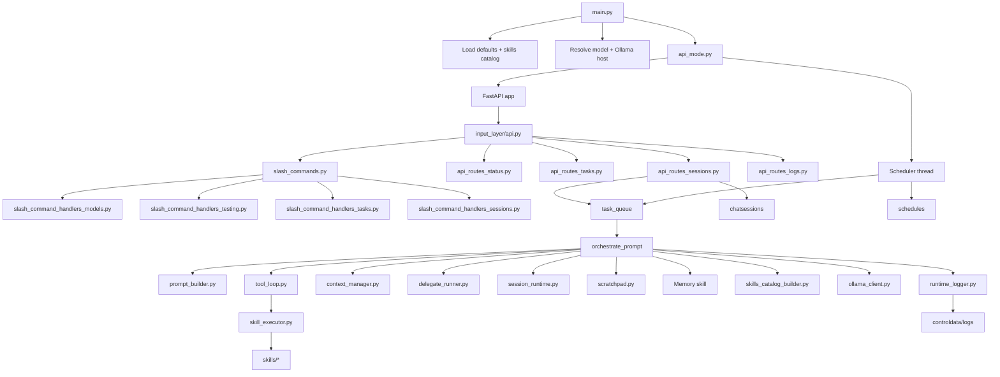

# MiniAgentFramework - Developer Notes


For user-facing setup and usage see [README.md](README.md).
For first-time setup see [README_GETTING_STARTED.md](README_GETTING_STARTED.md).

---

## Mental Model

MiniAgentFramework is a tool-calling Ollama agent with three big layers:

1. Entry + execution modes
   `code/main.py` starts the app, loads defaults/catalog, resolves the model, and launches either the web/API runtime or chat-sequence test mode.
2. Control plane
   `code/input_layer/` owns the browser UI, FastAPI routes, SSE streams, slash commands, session switching, history, and queue-facing endpoints.
3. Agent runtime
   `code/agent_core/` owns orchestration, tool execution, scratchpad, memory, skills catalog loading, and delegation.

The scheduler is parallel to the input layer: it queues background prompts into the same orchestration runtime used by the UI.

---

## Architecture Diagram



---

## Request Lifecycles

### 1. Interactive browser prompt

```text
Browser UI
  -> POST /sessions/{id}/prompt
  -> task_queue.enqueue(run_id, "api_chat", ...)
  -> orchestrate_prompt(...)
  -> tool_loop calls LLM and skills
  -> results streamed over /runs/{id}/stream SSE
  -> logs written to controldata/logs/YYYY-MM-DD/
  -> session turns persisted under controldata/chatsessions/
```

### 2. Slash command

```text
Browser input beginning with /
  -> slash_commands.handle(...)
  -> domain handler module
  -> mutate config / sessions / schedules / testing / host state
  -> stream progress lines back to UI
```

### 3. Scheduled task

```text
scheduler.py
  -> loads task_*.json from controldata/schedules/
  -> checks due tasks
  -> queues work on task_queue
  -> run_helpers.run_prompt_batch(...)
  -> orchestrate_prompt(...) using a task session
```

### 4. Delegate child run

```text
Parent tool loop
  -> Delegate skill
  -> delegate_runner.run_delegate_subrun(...)
  -> child orchestrate_prompt(...)
  -> child answer returned to parent as tool result
```

---

## Code Layout

```text
code/
  main.py
  agent_core/
    orchestration.py
    context_manager.py
    prompt_builder.py
    tool_loop.py
    delegate_runner.py
    session_runtime.py
    run_helpers.py
    tool_result.py
    scratchpad.py
    skill_executor.py
    skills_catalog_builder.py
    skills/
  input_layer/
    api.py
    api_routes_status.py
    api_routes_tasks.py
    api_routes_sessions.py
    api_routes_logs.py
    slash_commands.py
    slash_command_context.py
    slash_command_handlers_models.py
    slash_command_handlers_testing.py
    slash_command_handlers_tasks.py
    slash_command_handlers_sessions.py
    ui/
  scheduler/
  utils/
```

---

## Core Runtime

### `code/main.py`

- Entry point.
- Loads `controldata/default.json`.
- Resolves model and host.
- Loads `code/agent_core/skills/skills_catalog.json`.
- Starts API mode via `input_layer/api_mode.py`.
- Also supports internal chat-sequence mode used by the test wrapper.

### `code/agent_core/orchestration.py`

- Public coordination layer.
- Still exposes the stable public runtime API:
  - `OrchestratorConfig`
  - `ConversationHistory`
  - `SessionContext`
  - `orchestrate_prompt(...)`
  - `delegate_subrun(...)`
- Delegates most heavy runtime work to the extracted modules below.

### `code/agent_core/prompt_builder.py`

- Builds the full system prompt.
- Merges:
  - base behavior rules
  - ambient system info
  - prior session context
  - optional conversation summary
  - optional skill guidance
  - scratchpad key visibility
  - sandbox status

### `code/agent_core/tool_loop.py`

- Owns the round-by-round tool-calling loop.
- Responsibilities:
  - call the LLM with tools
  - detect malformed tool-call retries
  - execute tool calls
  - auto-save large tool outputs to scratchpad
  - synthesize final answer when tools are exhausted
  - strip planning preamble from model output
  - optionally write `WRITE_FILE` blocks to disk

### `code/agent_core/context_manager.py`

- Owns per-run context-map helpers.
- Responsibilities:
  - last-run diagnostic state for `/ctx`
  - context compaction
  - context-map formatting
  - estimated thread-size accounting

The context map is the runtime’s internal “what is in context right now?” table. Each entry tracks:
- round
- role
- label
- chars
- `msg_idx`
- optional `auto_key`
- optional `compacted`

### `code/agent_core/delegate_runner.py`

- Owns delegate runtime state and child-run execution.
- Keeps a thread-local delegate runtime context:
  - logger
  - delegate depth
  - active orchestrator config
- Enforces delegate safety limits:
  - max depth
  - child iteration cap
  - optional delegate removal from the child toolset

### `code/agent_core/session_runtime.py`

- Session binding based on `ContextVar`.
- This is what lets the scratchpad and related runtime pieces know which session is active inside a given orchestration run.

### `code/agent_core/run_helpers.py`

- Shared helpers for multi-prompt runs.
- Used by scheduled tasks and test-ish batch flows.
- Main helpers:
  - `make_task_session(...)`
  - `run_prompt_batch(...)`

### `code/agent_core/tool_result.py`

- Structured result object for tool execution.
- This replaced stringly-typed “error result” handling in the runtime and is one of the main pieces that made the orchestration split safer.

---

## Tool Execution

### `code/agent_core/skill_executor.py`

- Executes individual tool calls selected by the LLM.
- Builds catalog gates from the loaded skills payload.
- Resolves prompt tokens and tool arguments.
- Dynamically imports the approved skill function and returns a `ToolCallResult`.

### `code/agent_core/skills_catalog_builder.py`

- Reads skill metadata and produces:
  - `skills_catalog.json` for runtime
  - `skills_summary.md` for human inspection
- `build_tool_definitions(...)` converts the loaded catalog into JSON Schema tool definitions for Ollama tool-calling.

### `code/agent_core/skills/`

- Each skill folder contains a `skill.md` and usually a Python module.
- Runtime source of truth is now the generated JSON catalog, not `skills_summary.md`.

Key built-in skill families:
- system and utility: `SystemInfo`, `DateTime`, `Scratchpad`, `CodeExecute`
- file/task/runtime: `FileAccess`, `TaskManagement`, `Delegate`
- memory and retrieval: `Memory`, `Wikipedia`, `Kiwix`
- web stack: `WebSearch`, `WebFetch`, `WebNavigate`, `WebResearch`

---

## Scratchpad and Memory

### `code/agent_core/scratchpad.py`

- Session-scoped in-process store.
- Important: this is no longer one process-global flat store.
- Internally it keeps a per-session map keyed by the active session from `session_runtime.py`.
- Used for:
  - large tool output offloading
  - intermediate state between tools
  - explicit user-controlled scratch storage

### `code/agent_core/skills/Memory/`

- Durable long-lived fact storage.
- Persists to `controldata/memory_store.json`.
- Separate from scratchpad:
  - scratchpad = session-scoped working memory
  - memory skill = durable fact memory across runs

---

## Control Plane

### `code/input_layer/api.py`

- Main FastAPI entrypoint and shared state holder.
- Owns:
  - app creation
  - shared runtime state for tasks/logs/run queues
  - session persistence helpers
  - static file serving
  - history/completions/settings endpoints
- Registers route groups from the split route modules.

### Split route modules

- [api_routes_status.py](code/input_layer/api_routes_status.py)
  - `/version`
  - `/status/ollama`
- [api_routes_tasks.py](code/input_layer/api_routes_tasks.py)
  - `/tasks`
  - `/queue`
  - `/timeline`
- [api_routes_sessions.py](code/input_layer/api_routes_sessions.py)
  - `/sessions/{id}/prompt`
  - `/sessions/{id}/history`
  - `/runs/{id}/stream`
- [api_routes_logs.py](code/input_layer/api_routes_logs.py)
  - `/logs`
  - `/logs/latest`
  - `/logs/{date}/{filename}`
  - `/logs/stream`
  - `/logs/file`

### `code/input_layer/slash_commands.py`

- Thin slash-command dispatcher.
- Holds shared/general commands and the registry.
- Imports clearly named handler modules rather than keeping every command in one file.

### Split slash-command modules

- `slash_command_handlers_models.py`
  - `/models`
  - `/model`
  - `/stopmodel`
  - `/ollamahost`
  - `/kiwixhost`
- `slash_command_handlers_testing.py`
  - `/test`
  - `/testtrend`
- `slash_command_handlers_tasks.py`
  - `/tasks`
  - `/task`
- `slash_command_handlers_sessions.py`
  - `/session ...`

### `code/input_layer/slash_command_context.py`

- The transport-agnostic context object passed into slash commands.
- Carries:
  - mutable config
  - output callback
  - history/session reset hooks
  - optional session switching hooks

### `code/input_layer/ui/app.js`

- Browser-side state machine for the web UI.
- Owns:
  - prompt submission
  - run SSE streaming
  - log streaming
  - session switching
  - slash suggestion UX
  - task/timeline panels

---

## Scheduler

### `code/scheduler/scheduler.py`

- Loads task JSON files from `controldata/schedules/`.
- Determines whether a task is due.
- Enqueues background runs onto the shared task queue.
- The queue serializes work that should not overlap.

The important mental model here is: browser prompts and scheduled tasks ultimately converge on the same orchestration runtime.

---

## Runtime Data

Everything mutable lives under `controldata/`.

| Path | Purpose |
|---|---|
| `controldata/default.json` | persisted startup defaults |
| `controldata/chathistory.json` | UI input history |
| `controldata/memory_store.json` | durable memory facts |
| `controldata/chatsessions/` | session files and persisted conversation state |
| `controldata/chatsessions/named/` | named sessions |
| `controldata/logs/YYYY-MM-DD/` | runtime evidence logs |
| `controldata/schedules/` | scheduled tasks |
| `controldata/test_prompts/` | prompt suites |
| `controldata/test_results/YYYY-MM-DD/` | test CSV outputs |

---

## Things To Remember

- `skills_catalog.json` is the runtime catalog. `skills_summary.md` is documentation.
- Scratchpad is session-scoped in-process working memory, not durable memory.
- `orchestration.py` is now the public coordinator, not the only place where orchestration logic lives.
- The browser/API layer and the scheduler both feed the same queue and orchestration runtime.
- Slash commands are now split by domain; if you need a command, start in the matching `slash_command_handlers_*` file.
- API routes are now split by domain; start with `api_routes_*` before digging into `api.py`.

---

## Suggested Reading Order

If you are coming back to the code after a refactor, this order should rebuild the mental model quickly:

1. [code/main.py](code/main.py)
2. [code/input_layer/api.py](code/input_layer/api.py)
3. [code/input_layer/api_routes_sessions.py](code/input_layer/api_routes_sessions.py)
4. [code/input_layer/slash_commands.py](code/input_layer/slash_commands.py)
5. [code/agent_core/orchestration.py](code/agent_core/orchestration.py)
6. [code/agent_core/prompt_builder.py](code/agent_core/prompt_builder.py)
7. [code/agent_core/tool_loop.py](code/agent_core/tool_loop.py)
8. [code/agent_core/context_manager.py](code/agent_core/context_manager.py)
9. [code/agent_core/delegate_runner.py](code/agent_core/delegate_runner.py)
10. [code/agent_core/skill_executor.py](code/agent_core/skill_executor.py)

